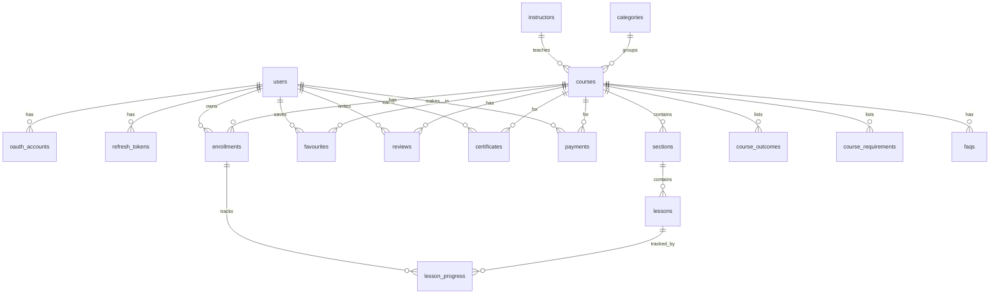

# Kaistrum Academy — Backend Schema & API

Backend contract inferred from the current front end (course catalogue, filtering/search,
course detail + curriculum, the Tiptap lesson player, enrolment & progress, favourites,
reviews-after-completion, certificates, KES pricing, and the sign-in flow).

- **Style:** PostgreSQL-flavoured DDL, REST over JSON.
- **IDs:** UUID (v4) primary keys unless noted. `slug` columns are the public, URL-facing keys.
- **Timestamps:** `timestamptz`, UTC. Every table has `created_at` and (where mutable) `updated_at`.
- **Money:** integer **minor-unit-free** shillings (`price_kes int`) — the UI renders `KES` / `Ksh`.
- **Auth:** stateless access token (JWT, `Authorization: Bearer <token>`) + rotating refresh token.

---

## 1. Database schema

### 1.1 Entity–relationship overview

### 1.2 Enumerated types

| Enum | Values |
|------|--------|
| `course_format` | `web_course`, `training_seminar`, `tutorial`, `learning_path` |
| `course_level` | `beginner`, `intermediate`, `advanced` |
| `enrollment_status` | `active`, `completed` |
| `payment_status` | `pending`, `paid`, `failed`, `refunded` |
| `payment_provider` | `mpesa`, `card`, `manual` |
| `oauth_provider` | `google`, `github` |
| `user_role` | `learner`, `instructor`, `admin` |

### 1.3 Tables

#### `users`
| Column | Type | Notes |
|--------|------|-------|
| `id` | uuid PK | |
| `name` | text | e.g. "Sam Okoro" |
| `email` | citext UNIQUE | login identifier |
| `password_hash` | text NULL | null for OAuth-only accounts |
| `avatar_url` | text NULL | Avatar falls back to initials |
| `role` | `user_role` | default `learner` |
| `email_verified_at` | timestamptz NULL | |
| `created_at` / `updated_at` | timestamptz | |

#### `oauth_accounts` — "Continue with Google/GitHub"
| Column | Type | Notes |
|--------|------|-------|
| `id` | uuid PK | |
| `user_id` | uuid FK → users | |
| `provider` | `oauth_provider` | |
| `provider_account_id` | text | |
| `created_at` | timestamptz | |
| | | UNIQUE (`provider`, `provider_account_id`) |

#### `refresh_tokens`
| Column | Type | Notes |
|--------|------|-------|
| `id` | uuid PK | |
| `user_id` | uuid FK → users | |
| `token_hash` | text | hashed, never stored raw |
| `expires_at` | timestamptz | |
| `revoked_at` | timestamptz NULL | rotation / logout |
| `user_agent` | text NULL | "Remember me" device |
| `created_at` | timestamptz | |

#### `instructors` — course authors
| Column | Type | Notes |
|--------|------|-------|
| `id` | uuid PK | |
| `user_id` | uuid FK → users NULL | if the instructor is also an account |
| `name` | text | "Dr. Alex Rivera" |
| `title` | text | "Principal Geospatial Engineer" |
| `bio` | text | |
| `avatar_url` | text NULL | |
| `rating` | numeric(2,1) | aggregate, cached |
| `students_count` | int | aggregate, cached (e.g. 48000) |
| `courses_count` | int | aggregate, cached |

#### `categories` — "Browse by topic" tracks
| Column | Type | Notes |
|--------|------|-------|
| `id` | uuid PK | |
| `slug` | text UNIQUE | `mapping`, `scripting`, … |
| `name` | text | "Spatial Analysis & Data Science" |
| `icon` | text | lucide icon name (`Map`, `Code2`, …) |
| `blurb` | text | short description |
| `sort_order` | int | |

#### `courses`
| Column | Type | Notes |
|--------|------|-------|
| `id` | uuid PK | |
| `slug` | text UNIQUE | URL key |
| `title` | text | |
| `summary` | text | card/one-liner |
| `description` | text | markdown, multi-paragraph "About this course" |
| `category_id` | uuid FK → categories | |
| `instructor_id` | uuid FK → instructors | |
| `format` | `course_format` | |
| `level` | `course_level` | |
| `is_premium` | boolean | gates pricing & "Enroll now" |
| `price_kes` | int NULL | null when free; e.g. 5900 |
| `original_price_kes` | int NULL | strikethrough price, e.g. 9400 |
| `is_featured` | boolean | Home "Featured courses" |
| `duration_minutes` | int | cached ∑ lesson minutes |
| `lesson_count` | int | cached |
| `rating_avg` | numeric(2,1) | cached from `reviews` |
| `rating_count` | int | cached |
| `learners_count` | int | cached (e.g. 8100) |
| `published_at` | timestamptz NULL | drives "Recently Added" sort |
| `created_at` / `updated_at` | timestamptz | |

#### `sections` — curriculum groups ("01. Foundations")
| Column | Type | Notes |
|--------|------|-------|
| `id` | uuid PK | |
| `course_id` | uuid FK → courses | |
| `title` | text | |
| `sort_order` | int | |

#### `lessons`
| Column | Type | Notes |
|--------|------|-------|
| `id` | uuid PK | |
| `section_id` | uuid FK → sections | |
| `title` | text | |
| `duration_minutes` | int | |
| `is_preview` | boolean | free even when not enrolled |
| `video_url` | text NULL | |
| `content` | jsonb | Tiptap/ProseMirror document (rendered by the lesson player) |
| `sort_order` | int | |

#### `course_outcomes` — "What you'll learn"
| Column | Type | Notes |
|--------|------|-------|
| `id` | uuid PK | |
| `course_id` | uuid FK → courses | |
| `text` | text | |
| `sort_order` | int | |

#### `course_requirements` — "Requirements"
| Column | Type | Notes |
|--------|------|-------|
| `id` | uuid PK | |
| `course_id` | uuid FK → courses | |
| `text` | text | |
| `sort_order` | int | |

#### `faqs`
| Column | Type | Notes |
|--------|------|-------|
| `id` | uuid PK | |
| `course_id` | uuid FK → courses | |
| `question` | text | |
| `answer` | text | |
| `sort_order` | int | |

#### `enrollments`
| Column | Type | Notes |
|--------|------|-------|
| `id` | uuid PK | |
| `user_id` | uuid FK → users | |
| `course_id` | uuid FK → courses | |
| `status` | `enrollment_status` | `active` / `completed` |
| `progress_pct` | int | 0–100, derived from `lesson_progress` |
| `completed_lessons` | int | cached count |
| `last_accessed_at` | timestamptz | "last opened 2 days ago" |
| `enrolled_at` | timestamptz | |
| `completed_at` | timestamptz NULL | set when progress hits 100 |
| | | UNIQUE (`user_id`, `course_id`) |

#### `lesson_progress`
| Column | Type | Notes |
|--------|------|-------|
| `id` | uuid PK | |
| `enrollment_id` | uuid FK → enrollments | |
| `lesson_id` | uuid FK → lessons | |
| `completed_at` | timestamptz | |
| | | UNIQUE (`enrollment_id`, `lesson_id`) |

#### `favourites` — "Saved courses"
| Column | Type | Notes |
|--------|------|-------|
| `id` | uuid PK | |
| `user_id` | uuid FK → users | |
| `course_id` | uuid FK → courses | |
| `created_at` | timestamptz | |
| | | UNIQUE (`user_id`, `course_id`) |

#### `reviews` — gated on completion
| Column | Type | Notes |
|--------|------|-------|
| `id` | uuid PK | |
| `user_id` | uuid FK → users | |
| `course_id` | uuid FK → courses | |
| `rating` | int | 1–5 |
| `body` | text | |
| `created_at` / `updated_at` | timestamptz | |
| | | UNIQUE (`user_id`, `course_id`); CHECK: author must have a `completed` enrollment |

#### `certificates`
| Column | Type | Notes |
|--------|------|-------|
| `id` | uuid PK | |
| `user_id` | uuid FK → users | |
| `course_id` | uuid FK → courses | |
| `serial` | text UNIQUE | printable/verifiable code |
| `issued_at` | timestamptz | |
| `file_url` | text NULL | rendered SVG/PDF (see `certificate.ts`) |
| | | UNIQUE (`user_id`, `course_id`) |

#### `payments` — premium purchase (KES)
| Column | Type | Notes |
|--------|------|-------|
| `id` | uuid PK | |
| `user_id` | uuid FK → users | |
| `course_id` | uuid FK → courses | |
| `amount_kes` | int | |
| `provider` | `payment_provider` | `mpesa` default for KES (Daraja STK push) |
| `provider_ref` | text NULL | checkout/transaction id |
| `status` | `payment_status` | |
| `created_at` / `updated_at` | timestamptz | |

---

## 2. API endpoints

Base URL: `/api/v1`. All list endpoints return `{ data, meta }`; errors return
`{ error: { code, message, fields? } }`. 🔒 = requires a valid access token.

### Conventions
- **Pagination:** `?page=1&page_size=6` → `meta: { page, page_size, total, total_pages }`.
- **Auth header:** `Authorization: Bearer <access_token>`.
- **Ownership:** `me` routes resolve the user from the token; no id in the path.

### 2.1 Auth — `/auth`
| Method | Path | Auth | Purpose |
|--------|------|:----:|---------|
| POST | `/auth/register` | — | Create account (name, email, password) → tokens |
| POST | `/auth/login` | — | Email + password → access + refresh tokens ("Remember me" ⇒ long-lived refresh) |
| POST | `/auth/logout` | 🔒 | Revoke the current refresh token |
| POST | `/auth/refresh` | — | Rotate refresh token → new access token |
| GET | `/auth/me` | 🔒 | Current user (hydrates the signed-in nav) |
| POST | `/auth/forgot-password` | — | Email a reset link ("Forgot password?") |
| POST | `/auth/reset-password` | — | Consume reset token + set new password |
| GET | `/auth/oauth/:provider` | — | Begin Google/GitHub OAuth (`provider` = `google` \| `github`) |
| GET | `/auth/oauth/:provider/callback` | — | Exchange code, upsert `oauth_accounts`, issue tokens |

### 2.2 Users — `/users`
| Method | Path | Auth | Purpose |
|--------|------|:----:|---------|
| GET | `/users/me` | 🔒 | Profile |
| PATCH | `/users/me` | 🔒 | Update name / avatar |
| GET | `/users/me/stats` | 🔒 | Dashboard tiles: enrolled, in_progress, completed, certificates, lessons_done, hours_learned |

### 2.3 Categories / Topics — `/categories`
| Method | Path | Auth | Purpose |
|--------|------|:----:|---------|
| GET | `/categories` | — | All tracks ("Browse by topic", filter dropdown) |
| GET | `/categories/:slug` | — | Single track + its course count |

### 2.4 Instructors — `/instructors`
| Method | Path | Auth | Purpose |
|--------|------|:----:|---------|
| GET | `/instructors/:id` | — | Author card (bio, rating, students, courses) |
| GET | `/instructors/:id/courses` | — | Their catalogue |

### 2.5 Courses — `/courses`
| Method | Path | Auth | Purpose |
|--------|------|:----:|---------|
| GET | `/courses` | — | Catalogue list. Query: `q`, `category`, `format`, `level`, `access=free\|premium`, `sort=recent\|rating\|popular\|az\|shortest`, `page`, `page_size` |
| GET | `/courses/featured` | — | Home "Featured courses" |
| GET | `/courses/:slug` | opt | Detail: summary, description, outcomes, requirements, faqs, instructor, price, curriculum outline, rating breakdown. If 🔒, also inlines the caller's `enrollment`/`is_favourite` |
| GET | `/courses/:slug/related` | — | "More in {category}" |
| GET | `/courses/:slug/reviews` | — | Paginated reviews + rating histogram (see 2.9) |

### 2.6 Course content / lessons — `/courses/:slug` (🔒 for locked lessons)
| Method | Path | Auth | Purpose |
|--------|------|:----:|---------|
| GET | `/courses/:slug/curriculum` | opt | Sections + lessons (title, minutes, `is_preview`, locked flag) |
| GET | `/courses/:slug/lessons/:lessonId` | opt | Lesson content (Tiptap JSON) + video. `403` if locked and not enrolled; `is_preview` lessons are open |

### 2.7 Enrolments — `/courses/:slug/enroll`, `/me/enrollments`
| Method | Path | Auth | Purpose |
|--------|------|:----:|---------|
| GET | `/me/enrollments` | 🔒 | "My learning" list (course + progress + next lesson) |
| POST | `/courses/:slug/enroll` | 🔒 | Enrol. Free ⇒ immediate; premium ⇒ `402` with a checkout ref (see 2.11) |
| GET | `/courses/:slug/enrollment` | 🔒 | Caller's progress for one course (sidebar progress card) |
| PUT | `/enrollments/:id/lessons/:lessonId/complete` | 🔒 | "Mark complete & continue" → upserts `lesson_progress`, recomputes `progress_pct`, may flip status to `completed` |
| DELETE | `/enrollments/:id` | 🔒 | Un-enrol |

### 2.8 Favourites — `/me/favourites`
| Method | Path | Auth | Purpose |
|--------|------|:----:|---------|
| GET | `/me/favourites` | 🔒 | Saved courses page |
| PUT | `/courses/:slug/favourite` | 🔒 | Save (heart on) — idempotent |
| DELETE | `/courses/:slug/favourite` | 🔒 | Unsave (heart off) |

### 2.9 Reviews — `/courses/:slug/reviews`
| Method | Path | Auth | Purpose |
|--------|------|:----:|---------|
| GET | `/courses/:slug/reviews` | — | List + `{ average, count, histogram: {5..1} }` |
| POST | `/courses/:slug/reviews` | 🔒 | Create (rating 1–5 + body). `403` unless the caller's enrollment is `completed` |
| PATCH | `/reviews/:id` | 🔒 | Edit own review |
| DELETE | `/reviews/:id` | 🔒 | Delete own review |

### 2.10 Certificates — `/me/certificates`
| Method | Path | Auth | Purpose |
|--------|------|:----:|---------|
| GET | `/me/certificates` | 🔒 | Earned certificates |
| POST | `/courses/:slug/certificate` | 🔒 | Issue on completion (idempotent) |
| GET | `/certificates/:id` | 🔒 | Metadata (name, course, hours, issued date, serial) |
| GET | `/certificates/:id/download?format=svg\|pdf` | 🔒 | Rendered file ("Download certificate") |
| GET | `/certificates/verify/:serial` | — | Public verification |

### 2.11 Payments / checkout — `/payments` (premium, KES)
| Method | Path | Auth | Purpose |
|--------|------|:----:|---------|
| POST | `/courses/:slug/checkout` | 🔒 | Create a `payments` row; returns M-Pesa STK-push ref (or card intent) |
| GET | `/payments/:id` | 🔒 | Poll payment status |
| POST | `/payments/webhook` | — | Provider callback → mark `paid`/`failed`, then create the `enrollment` |
| GET | `/me/orders` | 🔒 | Purchase history |

---

## 3. How the UI maps to the API

| Page | Primary endpoints |
|------|-------------------|
| Home `/` | `GET /categories`, `GET /courses/featured`, `GET /courses?q=` |
| Courses `/courses` | `GET /courses?...` (filters, sort, pagination), `GET /categories` |
| Course detail `/courses/[slug]` | `GET /courses/:slug`, `GET /courses/:slug/reviews`, `PUT/DELETE …/favourite`, `POST …/enroll` or `/checkout`, `POST …/reviews` |
| Lesson player `/courses/[slug]/learn` | `GET …/curriculum`, `GET …/lessons/:id`, `PUT …/lessons/:id/complete` |
| My learning `/my-learning` | `GET /me/enrollments`, `GET /users/me/stats`, `GET /me/certificates`, `GET …/certificate/download` |
| Saved `/favourites` | `GET /me/favourites`, `DELETE …/favourite` |
| Sign in `/signin` | `POST /auth/login`, `GET /auth/oauth/:provider`, `POST /auth/register` |
